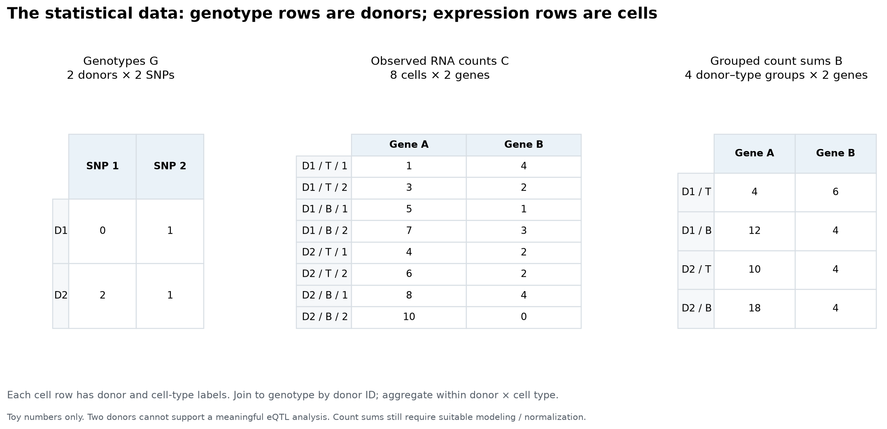
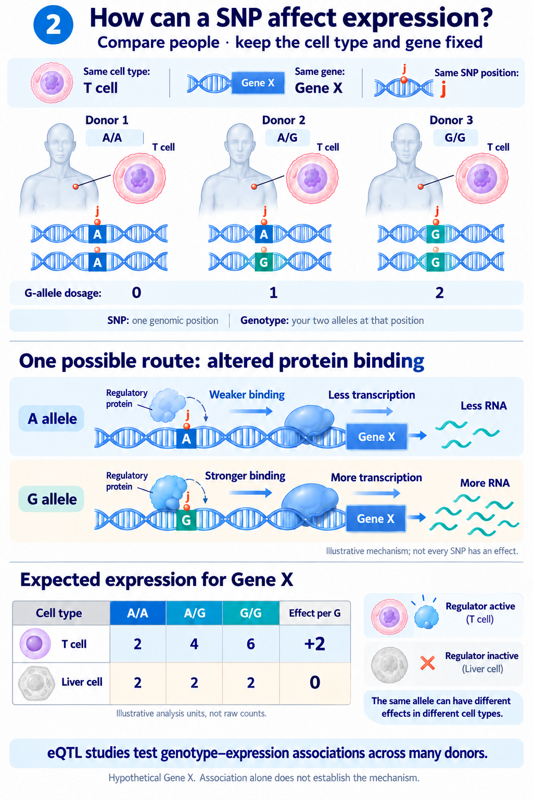
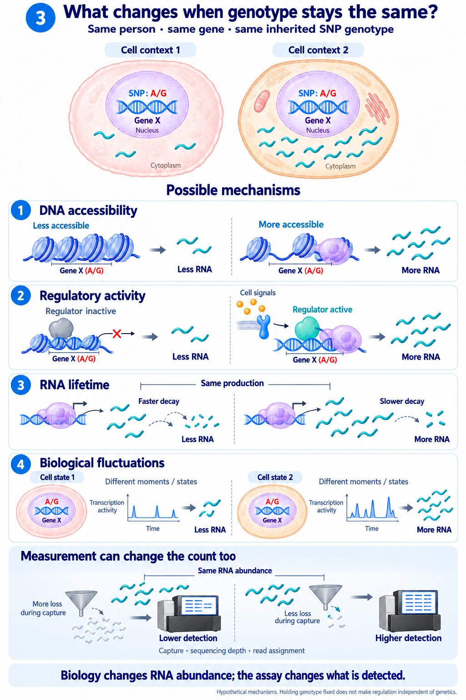

---
{
  "slug": "cell-study",
  "title": "how we understand cell level change?",
  "date": "2026-09-30",
}
---

## Starting question

Based on [CIGMA](https://www.nature.com/articles/s41586-026-10577-6), we have a first step in understanding cell, gene and SNP level data. Different people has different SNP (0,1,2) at different positions, how these genetic variant regulate the change in cell level expression, finally cause the disease. Cell- level paper
are massive, as we have genetic variant level data (SNP), gene level data (EN10001), cell level data (cell id), cell type data (T cell) and cell state. My starting point at these topic is from understanding the 
basic interaction between these variables, and dig into further to understand the regulation pathways. 

## Definition for each biological Item
**DNA** is a long molecular sequence using the base A, C, G, and T. In a simplified diploid autosomal example, a donor has two copies of each locus.

**A gene** is an annotated region of DNA from which RNA is transcribedl some RNA products lead to proteins and others function as RNA. "Gene A" names a genomic feature, a gene-level count generally
combines evidence assigned to that gene.

**A SNP** is a genomic position with a single-base variant. It is not a tiny expression measurement. A SNP can be inside a gene or elsewhere, including regulatory regions. Its location alone does not establish that it regulates a particular gene. [SNP definition](https://www.genome.gov/genetics-glossary/Single-Nucleotide-Polymorphisms-SNPs)

**A cell** is a biological compartment with its own molecular state. Two cells can have essentially the same inherited DNA but produce different amounts of RNA. Here I focus on inherited autosomal variation; somatic mutations, copy-number alterations, and immune-receptor rearrangements are outside this first model.

**Expression** is the production of gene products. For this diary, “expression” refers to an RNA-based measurement. The DNA locus and the amount of RNA associated with it are different objects. [Gene expression](https://www.genome.gov/genetics-glossary/Gene-Expression)

*Figure 1. One donor is heterozygous A/G at a SNP. A T cell and a B cell share that inherited genotype but contain different numbers of RNA molecules from the depicted gene. Orange RNA marks represent an idealized captured subset. All numbers are invented.*

## 2. Notation

| Symbol | Definition | Level / possible values |
|---|---|---|
| $i$ | Donor | $1,\ldots,N$ |
| $c$ | Cell type | $1,\ldots,T$ |
| $g$ | Gene | $1,\ldots,Q$ |
| $j$ | Variant / SNP | $1,\ldots,P$ |
| $\mathcal L_g$ | Gene's annotated DNA locus | Genome assembly, chromosome, coordinates, strand, transcript annotation |
| $G_{ij}$ | Number of selected alleles at SNP $j$ in donor $i$ | Usually $0,1,2$ for hard-called diploid genotypes |
| $M_{icg}$ | Actual number of RNA molecules for gene $g$ in a cell at collection | Latent nonnegative integer |
| $C_{icg}$ | Observed UMI count assigned to gene $g$ in that cell | Observed nonnegative integer |
| $L_{ic}$ | Total observed UMI count across the selected gene universe | $\sum_g C_{icsg}$ |
| $X_{icg}$ | A chosen transformed expression measurement | Usually real-valued |
| $B_{icg}$ | Sum of counts in one donor–type group | $\sum_s C_{icsg}$ |
| $Y_{icg}$ | Mean transformed expression in one donor–type group | $\sum_s X_{icsg}/n_{ic}$ |
| $\beta_{gjc}$ | Statistical effect of variant $j$ on gene $g$ in type $c$ | Model parameter on a specified scale |
| $a_{igc}$ | Modeled genetic contribution to expression | Weighted sum of genotype variables |

**Notation rule:** $\mathcal L_g$ is the physical feature; $C$, $X$, and $Y$ are measurements or summaries of that feature; $a$ is a modeled component. They should not all be called “the gene.”

Usually the RNA count in a certain cell with a tagged DNA could be modelled as a Poisson Process (so this is different for each donor, in each cell for a particular gene). 
$$
M \mid\lambda
\sim \mathrm{Poisson}(\lambda),
\qquad
C\mid M,q
\sim \mathrm{Binomial}(M,q).
$$
Since we only capture a small fraction $(q)$ of those molecules during the sequencing experiment. The observed count could is a sample of the true abundance. Then through statistics computation we get
$$
C\mid\lambda,q
\sim \mathrm{Poisson}(q\lambda).
$$

The model would like to show the potential biological process and the technique bias brought. 

## 4. Data form

The genetic predictors form a donor-by-variant matrix:

$$
\mathbf G\in\{0,1,2\}^{N\times P}.
$$

The RNA observations can be arranged as a cell-by-gene matrix:

$$
\mathbf C\in\mathbb N_0^{S\times Q},
\qquad S=\sum_{i=1}^{N}\sum_{c=1}^{T}n_{ic}.
$$

Each RNA row needs metadata identifying its donor and cell type. Matrix orientation varies by software: standard 10x feature-barcode outputs put features in rows and barcodes in columns. My notation uses the transpose to emphasize cells as observations. [10x feature-barcode matrices](https://www.10xgenomics.com/support/software/cell-ranger/latest/analysis/outputs/cr-outputs-matrices)

*D stands for Donor. Genotypes belong to donors; counts belong to cells and genes. The final matrix sums cells within each donor–type group.*

For example, donor D1's two T cells have gene-A counts 1 and 3:

$$
B_{\mathrm{D1,T,A}}=1+3=4.
$$

## 5. Counts, normalized expression, and pseudobulk

A count depends partly on sequencing/capture depth. One possible transformation for a cell with $L_{ics}>0$ is

$$
X_{icg}
=\log\left(1+10^4\frac{C_{icg}}{L_{ic}}\right).
$$

Usually people use natural log transformation for continuous type data, and normalized to a $10^4$ count for each cell. And a typical study on cell type specific count will aggregate all transformed counts shown in $Y_{icg}$

Two different group summaries must be distinguished:

$$
B_{icg}=\sum_{s=1}^{n_{ic}}C_{icsg},
\qquad
Y_{icg}=\frac{1}{n_{ic}}\sum_{s=1}^{n_{ic}}X_{icsg}.
$$

- $B$ is a **sum of raw counts**. It needs a suitable count model or subsequent normalization.
- $Y$ is a **mean of transformed cell measurements**. Its scale and uncertainty differ from those of $B$.

Both kinds of aggregation appear in workflows called pseudobulk.

For a mean such as $Y$, a simple estimate of finite-cell sampling variance is

$$
\widehat\delta_{icg}
=\frac{1}{n_{ic}}\,
\frac{1}{n_{ic}-1}
\sum_{s=1}^{n_{ic}}(X_{icsg}-Y_{icg})^2,
\qquad n_{ic}>1.
$$

## 6. Where does “a linear combination of SNPs” belong?

Fix gene $g$ and cell type $c$. A simple expression model across donors is

$$
Y_{icg}
=\mu_{gc}
+\mathbf w_i^\top\boldsymbol\gamma_{gc}
+\underbrace{\sum_{j\in\mathcal J_g}
\widetilde G_{ij}\beta_{gjc}}_{a_{igc}:\ \text{modeled genetic contribution}}
+r_{igc}.
$$

Here:

- $\mathcal J_g$ is the chosen set of predictor variants, for example those in a specified cis window. These variants need not lie inside the gene.
- $\widetilde G$ denotes centered, or centered and standardized, genotype values. The effect units depend on that choice.
- $\mathbf w_i$ contains measured covariates.
- $r_{igc}$ collects variation not represented by the fitted mean, including biological and measurement contributions as appropriate to the model.

The equation models a measurement of gene expression. 

For a concrete calculation, suppose centered predictors are $(1,-1)$ and coefficients are $(0.4,0.1)$. Then

$$
a_{igc}=1(0.4)+(-1)(0.1)=0.3.
$$

The number 0.3 is a model contribution on the chosen expression scale, not a gene, a molecule count, or a DNA sequence.

In vector form for all donors:

$$
\mathbf y_{gc}
=\mu_{gc}\mathbf 1+
\mathbf W\boldsymbol\gamma_{gc}
+\widetilde{\mathbf G}_{\mathcal J_g}\boldsymbol\beta_{gc}
+\mathbf r_{gc}.
$$

This is the connection to familiar regression: donors are rows; selected variants are predictors; one gene's expression in one cell type is the response.
## 7. An eQTL is a statistical relationship

A variant associated with variation in a gene's expression is called an expression quantitative trait locus, or eQTL. A gene is the expression feature being studied; an eQTL is a locus associated with that feature. Association alone does not establish that the tested variant is causal, especially when variants are correlated through linkage disequilibrium.

For a one-variant illustration:

$$
Y_{icg}=\mu_{gc}+G_{ij}\beta_{gjc}
+\text{covariate terms}+\text{error}.
$$

Three distinct questions are:

| Question | A corresponding comparison |
|---|---|
| Do average expression levels differ by cell type? | Cell-type means, e.g. $\mu_{g,\mathrm T}$ versus $\mu_{g,\mathrm B}$ |
| Is this SNP associated with expression in T cells? | $\beta_{gj,\mathrm T}=0$ versus an alternative |
| Does this SNP's effect differ between T and B cells? | $\beta_{gj,\mathrm T}=\beta_{gj,\mathrm B}$ versus an alternative |

## 8. Two comparisons: different cells and different people

### Different people: compare alleles at the same position

Now keep the cell type fixed and compare donors. The genomic position $j$ is the same, but the alleles can differ: A/A, A/G, or G/G. Counting the G allele gives $G_{ij}=0,1,2$. Each donor retains their own genotype across the two cell types.

*Figure 2. A hypothetical regulatory variant influences binding of an activator that is active in T cells but inactive in liver cells. This illustrates one possible genotype-by-context mechanism. The table shows expected expression on an illustrative analysis scale, not individual-cell counts. An association does not establish this mechanism. Other variants can affect other regulatory steps, and many variants have no detectable effect.*

The example table corresponds to

$$
E[Y_{i,\mathrm T,g}\mid G_{ij}]=2+2G_{ij},
\qquad
E[Y_{i,\mathrm L,g}\mid G_{ij}]=2+0G_{ij}.
$$

Here $\mathrm L$ denotes liver cells. These are simplified mean models on the chosen analysis scale; $Y$ is not the latent molecule number $M$.

| Comparison | What is held fixed? | What changes? |
|---|---|---|
| T cell versus liver cell within an A/G donor | Donor and genotype | Cellular context; expected values 4 versus 2 |
| A/A versus G/G donors within T cells | Cell type | Genotype; expected values 2 versus 6 |
| SNP effect in T cells versus liver cells | Gene, tested SNP, and expression scale | Effect per G allele: 2 versus 0 |

The first comparison is a context difference. The second concerns association with genotype. The third concerns whether the genotype effect depends on context. A baseline cell-type difference can also occur when the SNP effect is identical across types.

In real data, different people differ at many variants and in non-genetic factors. Two or three illustrated people cannot isolate a SNP effect. eQTL analyses use many donors, appropriate covariates and dependence models, and account for correlated variants; mechanistic claims need additional evidence. Tissue- and cell-context-dependent genetic associations are documented in GTEx. [GTEx atlas](https://pmc.ncbi.nlm.nih.gov/articles/PMC7737656/)

### Same person: hold inherited genotype fixed

For the inherited autosomal SNP in these examples, a donor's T cell and liver cell have the same genotype. Their cellular environments differ. DNA accessibility, regulatory proteins, external signals, and RNA stability can change expression without changing that SNP's DNA sequence. Individual cells of the same type also fluctuate in state and transcriptional activity. [NHGRI: gene regulation](https://www.genome.gov/genetics-glossary/Gene-Regulation)

*Figure 3. Hold the donor's genotype A/G fixed and ask what else can change. The mechanisms are possibilities, not a claim that every gene behaves this way. Gene X is hypothetical; molecule drawings are schematic. The final panel holds RNA abundance fixed and changes detection. Regulatory mechanisms can themselves be influenced by genetics; holding genotype fixed does not make them independent of genetics.*

An elementary production–decay model makes the RNA-lifetime mechanism explicit. Let $\lambda_{icsg}(t)$ be expected RNA abundance, $k_{icsg}$ a constant production rate, and $d_{icsg}>0$ a first-order degradation rate:

$$
\frac{d\lambda_{icsg}(t)}{dt}
=k_{icsg}-d_{icsg}\lambda_{icsg}(t).
$$

At steady state, under these simplifying assumptions,

$$
\lambda^*_{icsg}=\frac{k_{icsg}}{d_{icsg}},
\qquad
E[C_{icsg}]=q_{ics}\lambda^*_{icsg}.
$$

The second equation uses the idealized detection model from Section 3. More production, slower degradation, or better detection can each increase the expected observed count. They are different mechanisms. Even with the same underlying parameters, realized counts fluctuate. RNA stability is itself a regulated component of expression. [RNA stability and posttranscriptional control](https://www.ncbi.nlm.nih.gov/books/NBK26890/)

## 9. Optional bridge: from SNP effects to variance components

Now I can ask why a model might estimate shared and specific variance rather than every individual SNP effect.

Consider a simplified random-effect construction:

$$
\beta_{gjc}=\alpha_{gj}+\eta_{gjc},
\qquad
a_{igc}=\sum_{j=1}^{P_g}Z_{ij}
(\alpha_{gj}+\eta_{gjc}).
$$

Here $Z$ is a standardized genotype matrix for the selected variants. Suppose the coefficients have mean zero, shared effects have variance $\sigma^2_{g,\mathrm{shared}}/P_g$, and type-specific deviations have variance $v_{gc}/P_g$. Assume independence across variant indices, between shared and specific components, and across types for the deviations.

Define a genetic relatedness matrix:

$$
K^{(g)}_{ik}=\frac{1}{P_g}\sum_{j=1}^{P_g}Z_{ij}Z_{kj}.
$$

Integrating over those random coefficients gives

$$
\operatorname{Cov}(a_{igc},a_{kgd}\mid Z)
=K^{(g)}_{ik}
\left[
\sigma^2_{g,\mathrm{shared}}
+\mathbf 1(c=d)v_{gc}
\right].
$$

This is a derivation under explicitly stated assumptions, not a biological identity. Within the same type, genetic covariance contains shared and specific terms. Across distinct types, only the shared term remains in this construction.

The full expression covariance must also account for residual donor effects, covariates, and measurement uncertainty. This example is a bridge to variance-component models, not a complete specification or implementation of CIGMA. CIGMA's stated goal is decomposing shared and specific genetic effects on expression. [CIGMA](https://github.com/Minhui-Chen/CIGMA)

## 10. My first problems to investigate

1. **Measurement versus biology:** how much of count variation comes from RNA abundance, capture, and sequencing?
2. **Experimental unit:** what is gained by adding more cells per donor versus more donors?
3. **Scale:** which expression scale makes the estimated effect meaningful for my question?
4. **Context:** should I use broad cell types, finer labels, or continuous cell states?
5. **Identifiability:** which covariance patterns distinguish genetic sharing from donor-level residual sharing?
6. 
## Sources and scope

- NHGRI: [gene](https://www.genome.gov/genetics-glossary/Gene), [SNP](https://www.genome.gov/genetics-glossary/Single-Nucleotide-Polymorphisms-SNPs), [gene expression](https://www.genome.gov/genetics-glossary/Gene-Expression).
- 10x Genomics: [from sequencing reads to counts](https://www.10xgenomics.com/blog/how-single-cell-sequencing-data-analysis-works), [feature-barcode matrices](https://www.10xgenomics.com/support/software/cell-ranger/latest/analysis/outputs/cr-outputs-matrices).
- [CIGMA source and model inputs](https://github.com/Minhui-Chen/CIGMA).
