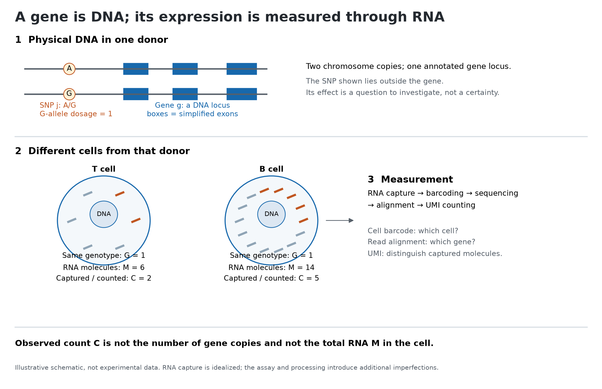

---
{
  "slug": "cell-study",
  "title": "how we understand cell level change?",
  "date": "2026-09-30",
  "date_label": "September 30, 2026",
  "status": "Working draft",
  "reading_time": "5 min read",
  "summary": "For statistician to understand massive problems in cell level study."
}
---

## Starting question

Different people has different SNP (0,1,2) at different positions, how these genetic variant regulate the change in cell level expression, finally cause the disease. Cell- level paper
are massive, as we have genetic variant level data (SNP), gene level data (EN10001), cell level data (cell id), cell type data (T cell) and cell state. My starting point at these topic is from understanding the 
basic interaction between these variables, and dig into further to understand the regulation pathways. 

## Definition for each biological Item
**DNA** is a long molecular sequence using the base A, C, G, and T. In a simplified diploid autosomal example, a donor has two copies of each locus.

**A gene** is an annotated region of DNA from which RNA is transcribedl some RNA products lead to proteins and others function as RNA. "Gene A" names a genomic feature, a gene-level count generally
combines evidence assigned to that gene.

**A SNP** is a genomic position with a single-base variant. It is not a tiny expression measurement. A SNP can be inside a gene or elsewhere, including regulatory regions. Its location alone does not establish that it regulates a particular gene. [SNP definition](https://www.genome.gov/genetics-glossary/Single-Nucleotide-Polymorphisms-SNPs)

**A cell** is a biological compartment with its own molecular state. Two cells can have essentially the same inherited DNA but produce different amounts of RNA. Here I focus on inherited autosomal variation; somatic mutations, copy-number alterations, and immune-receptor rearrangements are outside this first model.

**Expression** is the production of gene products. For this diary, “expression” refers to an RNA-based measurement. The DNA locus and the amount of RNA associated with it are different objects. [Gene expression](https://www.genome.gov/genetics-glossary/Gene-Expression)

Paper links, relevant sections, and my interpretation.

## What I currently understand

Explain the idea in my own words.

## Potential problem

What assumption, ambiguity, or limitation caught my attention?
Is this discussed in the paper, or is it my own hypothesis?

## Evidence or small experiment

A figure, code snippet, example, or counterexample.
This section can be omitted for a reading-only entry.

## Questions still open

- What remains unclear?
- What evidence would help?
- Which paper or experiment should I try next?

## References

Links to papers, documentation, and related diary entries.
